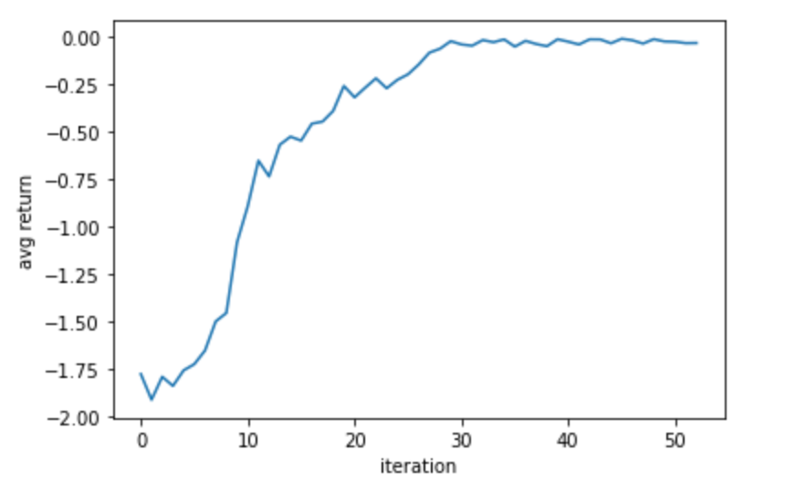

# RLHF Shakespeare

A transformer trained on the works of Shakespeare, then fine-tuned to generate positive sentiment samples using RLHF. 
This is a suggested exercise from chapter 7 of this [deep_learning_curriculum](https://github.com/jacobhilton/deep_learning_curriculum/blob/master/7-Alignment.md).

Here are some of samples after fine-tuning:


```
Becomes him nobly; So do's Arcites mirth,
But Palamons sadnes is a kinde of mirth,
So mingled, as if, as I, use love to thee,
Making more clamorous than to be
```
```
Becomes him nobly; So do's Arcites mirth,
But Palamons sadnes is a kinde of mirth,
So mingled, as, as if I were to love;
And every man could make more good
```

And a few from the pre-trained model, for comparison:
```
To strike him there, [_Reads._] Boy, I will you bite it,
And do my rage well compos’d it.
Who may be call’d Anchient Romeo’s friend,
```
```
I will forestall my right disgrace and ever.

SIR TOBY.
Come, come, sir.

CLOWN.
[_Sings._] Away, you’ll be hanged and hang yourselves
```


It seems to have learned to produce more positive samples, but at the expense
of variety and coherence.


## Training:

The model was fine-tuned using [PPO](https://arxiv.org/abs/1707.06347).



If you're curious about more metrics (fraction of ratios clipped, KL(current model || original model), intermediate samples),
you can check out the logs directory. 


## To reproduce:

1. Pre-train a transformer using a standard language modeling objective on the works of shakespeare:

```
python pre_train.py
```

2. Fine-tune a reward model that acts as a sentiment classifier,
trained on human labeled data:

```
python train_rew_model.py
```

3. Fine-tune a PPO agent to generate samples that are classified as positive sentiment by the reward model:

```
python train_ppo.py
```
